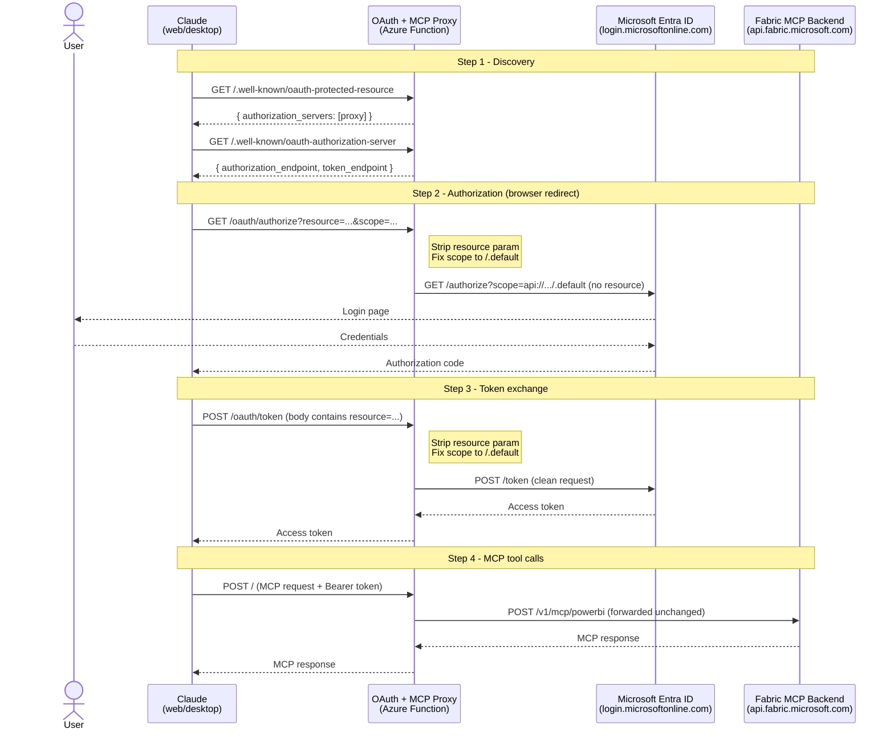

# Claude + Microsoft Fabric Remote MCP - Solution Writeup

**Prepared for:** Erik  
**Date:** March 5, 2026  
**Subject:** Fixing AADSTS901002 when connecting Claude to the Fabric Remote MCP Server

---

## Summary

Your setup was correct. The app registration, delegated permissions, and Fabric MCP endpoint were all configured properly. The error was caused by a known incompatibility between how Claude's MCP client initiates OAuth and what Microsoft Entra ID v2 accepts. The fix is a lightweight OAuth and MCP proxy deployed as an Azure Function in your tenant.

---

## The Problem

When an end user clicks **Connect** on the Fabric MCP connector in Claude, the following happens:

1. Claude reads OAuth discovery metadata from `api.fabric.microsoft.com/v1/mcp/powerbi`
2. Claude initiates an OAuth authorization request to Microsoft Entra ID
3. **Claude includes a `resource` parameter in that request**
4. Entra ID v2 endpoints reject any request containing `resource` - only `scope` is accepted
5. Entra returns: `AADSTS901002: The 'resource' request parameter is not supported`

This is not a misconfiguration. It is a conflict between the MCP specification (which permits the `resource` parameter per RFC 8707) and Microsoft's Entra ID v2 endpoints (which forbid it entirely). The error occurs before the user's credentials or permissions are even evaluated.

**Why the developer's Claude Code connection works:** Claude Code uses a different auth flow (client credentials via CLI) that does not send the `resource` parameter. Only the Claude web/desktop connector is affected.

This issue is publicly documented in multiple GitHub repositories:

- `microsoft/vscode#254009` - VS Code MCP sends `resource`, Entra rejects with AADSTS901002
- `modelcontextprotocol/modelcontextprotocol#1614` - MCP spec discussion on the conflict
- `modelcontextprotocol/csharp-sdk#648` - C# MCP SDK hits same error with Fabric

---

## The Solution: OAuth + MCP Proxy (Azure Function)

An Azure Function deployed in your tenant acts as a transparent proxy between Claude and your Fabric MCP endpoint. Claude points at the proxy instead of Fabric directly. The proxy:

1. **Serves its own OAuth discovery metadata** - so Claude sends all auth requests to the proxy, not directly to Entra
2. **Strips the `resource` parameter** from every OAuth request - the fix
3. **Reformats the scope** correctly as `https://api.fabric.microsoft.com/.default`
4. **Forwards the clean request to Entra** - login succeeds, token is issued
5. **Forwards all MCP tool calls transparently** to `api.fabric.microsoft.com` - Claude queries Fabric normally

All traffic between Claude and Fabric passes through the proxy - both the OAuth handshake and all MCP tool calls. The proxy fixes the OAuth request on the way in and forwards Fabric responses back to Claude unchanged. This means the proxy sits in the full data path, which your team should factor into security review and network design.

```
WITHOUT PROXY (broken):
Claude -> OAuth (with resource param) -> Entra -> AADSTS901002

WITH PROXY (fixed):
Claude -> proxy -> OAuth (resource stripped) -> Entra -> token issued
Claude -> proxy -> MCP tool calls -> Fabric -> data -> proxy -> Claude
```

---

## Architecture



---

## Errors Encountered and Fixed During Development

### Proxy-related errors (fixed by the proxy)

| Error Code                                           | Cause                                                                 | Resolution                                                                               |
| ---------------------------------------------------- | --------------------------------------------------------------------- | ---------------------------------------------------------------------------------------- |
| AADSTS901002                                         | Claude sends `resource` param, Entra v2 rejects it                    | Proxy strips `resource` before forwarding to Entra                                       |
| AADSTS650057                                         | `resource` param sent but app registration doesn't list that resource | Same fix - proxy strips `resource`, formats scope as `/.default`                         |
| "Error connecting to MCP server" (no auth initiated) | Claude couldn't read OAuth discovery metadata from the endpoint       | Proxy serves its own `/.well-known/oauth-protected-resource` metadata pointing at itself |

### App registration setup errors (not proxy-related)

| Error Code    | Cause                                                       | Resolution                                                                     |
| ------------- | ----------------------------------------------------------- | ------------------------------------------------------------------------------ |
| AADSTS7000218 | Token request missing `client_secret`                       | Added Client Secret to app registration and Claude connector Advanced Settings |
| AADSTS7000215 | Wrong value pasted - Secret ID used instead of Secret Value | Used the **Value** field from Certificates & Secrets, not the GUID Secret ID   |

---

## What Was Deployed

### Azure Function App (OAuth + MCP Proxy)

A Python Azure Function available at the root path `/` that handles:

- `/.well-known/oauth-protected-resource` - returns proxy's own OAuth metadata
- `/.well-known/oauth-authorization-server` - returns proxy's OAuth server config
- `/oauth/authorize` - strips `resource`, redirects to real Entra login
- `/oauth/token` - strips `resource`, fixes scope, forwards to Entra token endpoint
- Everything else - forwarded transparently to the real MCP backend

**Environment variables required:**

```
ENTRA_TENANT_ID  = your-tenant-id
MCP_BACKEND_URL  = https://api.fabric.microsoft.com/v1/mcp/powerbi
MCP_RESOURCE     = https://api.fabric.microsoft.com
```

### Entra ID App Registration (Claude MCP Test)

Configured with:

- **Client ID:** registered in your tenant
- **Client Secret:** generated and stored in Claude connector Advanced Settings
- **Redirect URI:** `https://claude.ai/api/mcp/auth_callback`
- **API Permissions:** delegated permissions for the MCP server resource
- **Admin consent:** granted tenant-wide

### Claude Connector Configuration

- **MCP Server URL:** `https://your-proxy.azurewebsites.net/`
- **OAuth Client ID:** your app registration Client ID
- **OAuth Client Secret:** your app registration Client Secret Value

---

## Validation

The proxy was validated end to end against the **Microsoft MCP Server for Enterprise** (`mcp.svc.cloud.microsoft/enterprise`) using a Microsoft 365 E5 developer sandbox tenant. Fabric MCP was not used directly in testing, but the OAuth flow is identical - both backends use Microsoft Entra ID v2 and the same token endpoint. The `resource` parameter rejection (AADSTS901002) occurs at the Entra layer before any backend-specific logic runs, so the fix applies equally to Fabric.

The full flow was confirmed working:

1. Claude reads proxy OAuth metadata
2. User clicks Connect, Microsoft login page appears
3. User signs in, Entra issues token (no AADSTS error)
4. Claude connector shows **Connected**
5. MCP tool calls forwarded to backend, real tenant data returned

Azure Function logs confirmed:

```
Token  Entra responded: 200
Forward POST https://mcp.svc.cloud.microsoft/enterprise/ HTTP/1.1 200 OK
UA: Claude-User
```

---

## Deployment Steps for Your Tenant

1. **Create an Azure Function App** in your Azure subscription (Python 3.12, Flex Consumption plan, Linux)
2. **Fork or copy the proxy source** into a GitHub repository
3. **Connect GitHub Actions** - the repo includes a workflow (`.github/workflows/main_proxy.yml`) that builds and deploys automatically on push to `main`; link it to your Function App's publish profile
4. **Set environment variables** in Function App - Configuration - Application Settings:
   - `ENTRA_TENANT_ID`, `MCP_BACKEND_URL`, `MCP_RESOURCE`
5. **Register an Entra app** (or reuse your existing one) with redirect URI `https://claude.ai/api/mcp/auth_callback` and your Fabric API permissions
6. **Update the Claude connector** to point at `https://your-proxy.azurewebsites.net/` with Client ID and Secret in Advanced Settings
7. **Test** - click Connect, sign in, ask Claude to list Power BI workspaces

---

## Security Notes

- The proxy runs entirely within your Azure tenant under your control
- **All traffic between Claude and Fabric passes through the proxy** - both OAuth and MCP tool calls including query results. This is by design and is what makes the fix possible.
- The proxy performs no logging of data payloads — only request metadata (method, path, status code) is logged
- Because data flows through the proxy, we recommend deploying it in the same Azure region as your Fabric resources and restricting inbound access to Claude's known IP ranges
- Tokens are not logged (only parameter names are logged, never values)
- The Function App can be locked down with Azure network policies or IP restrictions
- Flex Consumption plan cost is low - scales to zero when not in use
- Full source code provided for your team to audit and maintain

---

## References

- [MCP + Entra ID conflict (GitHub)](https://github.com/microsoft/vscode/issues/254009)
- [MCP spec resource parameter discussion](https://github.com/modelcontextprotocol/modelcontextprotocol/issues/1614)
- [Microsoft APIM + Claude MCP pattern](https://developer.microsoft.com/blog/claude-ready-secure-mcp-apim)
- [Microsoft MCP Server for Enterprise docs](https://learn.microsoft.com/en-us/graph/mcp-server/get-started)
- [Claude custom connectors documentation](https://support.claude.com/en/articles/11175166-get-started-with-custom-connectors-using-remote-mcp)
